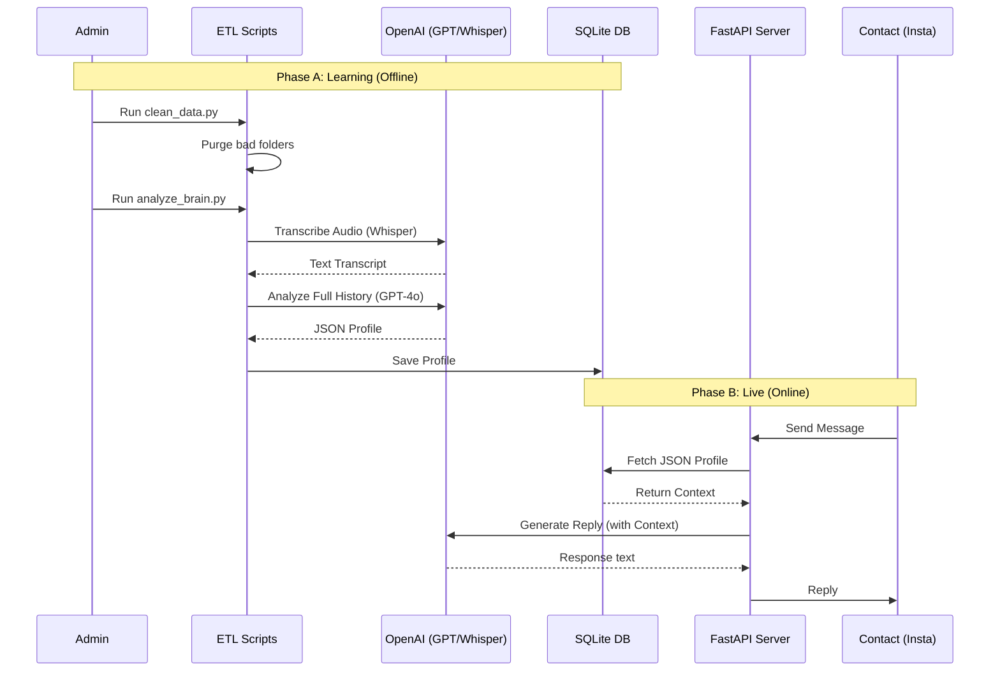

# 🏗️ Architecture & Execution Workflow

This document details the **Development Roadmap** (how the system was built) and the **Execution Logic** (how the data flows during runtime).

---

## 📅 Part 1: Development Roadmap (The Build Order)

This project was constructed in **5 distinct phases**, moving from data infrastructure to AI implementation.

### Phase 1: Foundation & Environment
Before writing logic, the environment was secured.
* **Dependencies:** Setup of `requirements.txt` to manage libraries like `fastapi`, `openai`, and `sqlalchemy`.
* **Security:** Configuration of `.env` files to isolate API Keys (OpenAI/Meta).

### Phase 2: Data Engineering (ETL)
Implementation of the **Extraction and Cleaning** layer.
* **Sanitization Script:** `clean_data.py` was built to scan local Meta exports. It compares folders against a "valid contacts" whitelist (DB) and purges irrelevant data while preserving VIP "Exceptions".

### Phase 3: Infrastructure & Storage
Setting up the persistent memory.
* **Database Schema:** SQLite was chosen for portability. Tables were designed to store:
    * `social_graph` (User profiles).
    * `audio_transcriptions` (Cached Whisper results).
    * `contacts` (Relationship tiers).

### Phase 4: The "Brain" (Core Intelligence)
Integration of Multimodal AI (Text + Audio).
* **Audio Module:** `transcribe_manager.py` was developed to detect `.mp4/.wav` files in HTML exports and transcribe them using **OpenAI Whisper-1**.
* **Profiling Engine:** `analyze_brain.py` aggregates text and audio, then feeds 300+ messages into **GPT-4o** to generate the "Social OS" JSON profile.

### Phase 5: The Interface (API)
* **Server Logic:** `main.py` and `run.py` were built using **FastAPI** to handle real-time webhooks and serve the AI responses.

---

## ⚙️ Part 2: Execution Workflow (Runtime Logic)

The system operates in two distinct modes: **Batch Learning** (Offline) and **Live Interaction** (Online).

### 🔄 Workflow A: The Learning Phase (Batch Processing)
*Run periodically (e.g., weekly) to update the bot's knowledge.*

1.  **Data Cleaning:**
    * `clean_data.py` executes.
    * It removes deleted friends or unknown contacts from the local storage to save space.
2.  **Multimodal Analysis:**
    * `analyze_brain.py` iterates through valid folders.
    * It calls `transcribe_manager.py`: If a voice note is found, it checks the SQL Cache. If missing, it calls the Whisper API.
3.  **Profile Generation:**
    * The aggregated conversation history is sent to GPT-4o.
    * A JSON profile is generated (identifying "Private Jokes", "Sensitive Topics", and "Tone").
    * The profile is saved to the SQLite database (`app.db`).

### ⚡ Workflow B: The Live Phase (Real-Time)
*Run permanently (24/7) to handle messages.*

1.  **Server Start:**
    * `run.py` initializes the Uvicorn server on port 8000.
    * `main.py` starts the FastAPI application.
2.  **Interaction Loop:**
    * 📥 **Webhook Event:** A message arrives from Instagram/WhatsApp.
    * 🔍 **DB Lookup:** The system queries `app.db` for the sender's `phone_id`.
    * 🧠 **Context Loading:** The specific JSON Profile is loaded (e.g., *User is Tier 1, use slang, avoid politics*).
    * 💬 **Generation:** GPT-4o generates a response strictly adhering to the JSON constraints.
    * 📤 **Response:** The message is sent back via API.

---

## 📊 Visual Sequence Diagram

