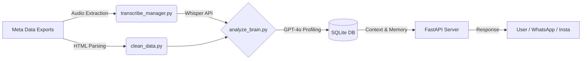

# 🧬 MyDigitalTwin: AI Social Operating System

> **A context-aware AI Agent that learns my communication style, processes audio/text, and acts as a Digital Twin on messaging platforms.**

## 📖 Project Overview
**MyDigitalTwin** is an automation framework designed to scale personal interactions without losing authenticity. 

Unlike generic chatbots, this "Social Operating System" uses **Few-Shot Learning** and **Multimodal Analysis** (Text + Audio) to build a psychological profile of every contact. It adapts its tone, vocabulary, and boundary levels based on a "Relationship Tier System" (e.g., using slang with close friends vs. polite language with professional contacts).

---

## 🏗️ System Architecture

--- 

## 🚀 Key Features

1. Hybrid "Social OS" Engine (Text + Audio)
The core intelligence (analyze_brain.py) doesn't just read text; it listens.

Audio Transcription: The transcribe_manager.py module detects <audio> tags in Instagram exports, hunts down the file on the disk (handling complex pathing issues), and transcribes it using OpenAI Whisper-1.

Smart Caching: To save costs and time, transcriptions are hashed and cached in a dedicated SQL table (audio_transcriptions).

2. Psychological Profiling (The "Brain")
Using GPT-4o, the system generates a "File Dossier" (JSON) for each contact. This ensures the bot remembers who it is talking to.

Real Example of a generated Profile:

{
  "identity": {
    "nickname": "Sarah 🎨",
    "real_relation": "Close childhood friend (Inner Circle)",
    "met_context": "High School Art Class",
    "key_people_in_common": ["Alex", "Julie", "Thomas"]
  },
  "communication_protocol": {
    "reply_speed_strategy": "Instant Reply",
    "preferred_medium": "Voice Notes (Audio)",
    "forbidden_behaviors": "Being formal, using 'Vous', giving unsolicited career advice"
  },
  "dynamic": {
    "reciprocity_score": "50/50",
    "current_mood": "Nostalgic and Complicit",
    "role_played_by_louis": "The Confidant / The Clown"
  },
  "memory_bank": {
    "private_jokes": ["The 2018 Taco incident", "Project X discount version"],
    "sensitive_topics": ["Her ex-boyfriend", "Divisive politics"]
  },
  "bot_instructions": {
    "tone": "Warm, heavy slang usage, frequent emojis",
    "golden_sample_reply": "Mdrrr mais non jure ?? C'est abusé 😭 appelle-moi ce soir !"
  }
}

[See profil_social_os_example.json for full structure]

3. Data Engineering & Governance
ETL Pipeline: The clean_data.py script acts as a garbage collector. It syncs the local storage with the valid contacts in the database, automatically purging unknown data while preserving "Exception" folders (VIPs).

Safety Guardrails: A Tier-Based System strictly controls the bot's language.

Tier 1 (VIP): Authorized to use slang ("mdr", "wsh", "frèro") and vulgarity.

Tier 3 (Pro): Forced into a formal, polite communication protocol.

---

## 🛠️ Technical Stack
Core Logic: Python 3.9+

API Framework: FastAPI, Uvicorn.

AI Models:

LLM: GPT-4o (Contextual analysis & generation).

ASR: Whisper-1 (Audio-to-Text).

Database: SQLite via SQLAlchemy (ORM).

Data Processing: BeautifulSoup4 (HTML Parsing), Regex.

---

## 📦 Installation & Setup
1. Prerequisites
Ensure you have Python 3.9+ installed.

2. Clone & Install

//
git clone [https://github.com/your-username/my-digital-twin.git](https://github.com/your-username/my-digital-twin.git)
cd my-digital-twin
pip install -r requirements.txt
//

3. Configuration
Create a .env file at the root:
//
OPENAI_API_KEY=sk-proj-your-key-here
DB_PATH=app.db
//

4. Initialize & Analyze
First, run the analysis pipeline to build the database and profiles://
//
# 1. Clean data folder
python clean_data.py

# 2. Transcribe audio & Build Profiles
python analyze_brain.py
//
5. Run the Server
Launch the FastAPI backend:
//
python main.py
# OR directly via Uvicorn
uvicorn app.main:app --reload

//

The API will be available at http://127.0.0.1:8000 with Swagger documentation at /docs.

## 🔒 Ethical Considerations
This project implements strict "Human-in-the-loop" protocols:

Sensitive Topic Detection: The bot halts if a topic from the sensitive_topics list is detected.

No Impersonation for Harm: The goal is to manage time, not to deceive.

Local Data: All personal messages are processed locally or via secure API, with no third-party training.

##📝 License
This project is for personal research and educational purposes.
