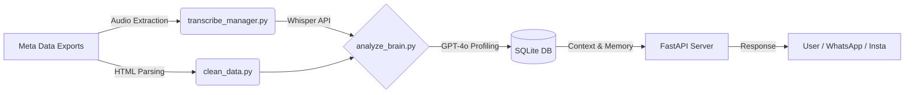

# 🧬 MyDigitalTwin: AI Social Operating System

> **A context-aware AI Agent that learns my communication style, processes audio/text, and acts as a Digital Twin on messaging platforms.**


## 📖 Project Overview
**MyDigitalTwin** is an automation framework designed to scale personal interactions without losing authenticity. 

Unlike generic chatbots, this "Social Operating System" uses **Few-Shot Learning** and **Multimodal Analysis** (Text + Audio) to build a psychological profile of every contact. It adapts its tone, vocabulary, and boundary levels based on a "Relationship Tier System" (e.g., using slang with close friends vs. polite language with professional contacts).

---

## 🏗️ System Architecture


[About Architecture](ARCHITECTURE.md)
--- 


## 🚀 Key Features

**1. Hybrid "Social OS" Engine (Text + Audio)**
The core intelligence (`analyze_brain.py`) goes beyond simple text processing—it actually "listens" to your digital history.

* **Advanced Audio Transcription:** The `transcribe_manager.py` module automatically identifies `<audio>` tags within Instagram exports. It resolves complex local file paths to locate recordings and transcribes them using **OpenAI Whisper-1**.
* **Smart Caching System:** To minimize API costs and latency, transcriptions are hashed and stored in a dedicated `audio_transcriptions` SQL table, ensuring no file is processed twice.

**2. Psychological Profiling (The "Brain")**
Leveraging **GPT-4o**, the system constructs a comprehensive "File Dossier" (JSON) for every contact. This persistent memory allows the bot to maintain deep contextual awareness of who it is interacting with.


**Real Example of a generated Profile:**

```json
{
  "identity": {
    "nickname": "Sarah 🎨",
    "real_relation": "Close childhood friend (Inner Circle)",
    "met_context": "High School Art Class",
    "key_people_in_common": ["Alex", "Julie", "Thomas"]
  },
  "communication_protocol": {
    "reply_speed_strategy": "Instant Reply",
    "preferred_medium": "Voice Notes (Audio)",
    "forbidden_behaviors": "Being formal, using 'Vous', giving unsolicited career advice"
  },
  "dynamic": {
    "reciprocity_score": "50/50",
    "current_mood": "Nostalgic and Complicit",
    "role_played_by_louis": "The Confidant / The Clown"
  },
  "memory_bank": {
    "private_jokes": ["The 2018 Taco incident", "Project X discount version"],
    "sensitive_topics": ["Her ex-boyfriend", "Divisive politics"]
  },
  "bot_instructions": {
    "tone": "Warm, heavy slang usage, frequent emojis",
    "golden_sample_reply": "Mdrrr mais non jure ?? C'est abusé 😭 appelle-moi ce soir !"
  }
}

```

[See profil_social_os_example.json for full structure]


## ⚙️ Configuration

Create a `.env` file at the root of the project to store your API keys and parameters:

```env
OPENAI_API_KEY=your_api_key_here
DB_PATH=app.db
```
---


## 🚀 Initialization

Before launching the server, you must prepare the data and generate the psychological profiles:

```
# 1. Clean and prepare data directories
python clean_data.py

# 2. Transcribe audio files and build the "Brain" (JSON Profiles)
python analyze_brain.py

```
---

### 💻 Launch
```markdown
Once initialization is complete, start the FastAPI backend:
python main.py
```

The API will be live at http://127.0.0.1:8000. You can access the interactive documentation (Swagger UI) at /docs

---

### 🧪 Testing with Mock Data
To test the analysis pipeline without using your own private data, use the provided samples:

## 🔒 Ethics & Security

This project incorporates strict security protocols:

* **Sensitive Topic Detection:** The bot automatically halts if a topic listed in the profile's `sensitive_topics` is detected.
* **
##📝 License
This project is for personal research and educational purposes.
